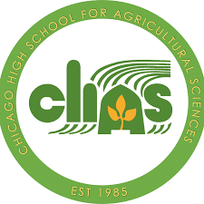

## Cara O'Shea

<!--
**cdunnerun/cdunnerun** is a ✨ _special_ ✨ repository because its `README.md` (this file) appears on your GitHub profile.-->

**College:** 
Loyola University of Chicago

**Interests:**
Running, Raising College Kids, Traveling, Teaching

**Occupation:**
Teacher at Chicago High School for Agricultural Sciences

)

**Contact:**
cadunne@cps.edu 

**Biography:**
This is my 27th year in education. I have taught social studies and computer sciences since 1999. I have tried many different roles at my school but my current role of AP CSP and AP Human Geography teacher is the greatest!
I have three children and a cutie dog. My husband and I have always lived in Chicago. I meet my husband when I was in 8th grade. 

